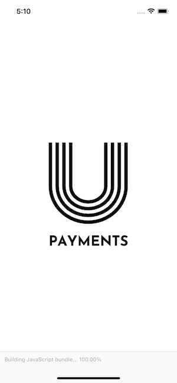
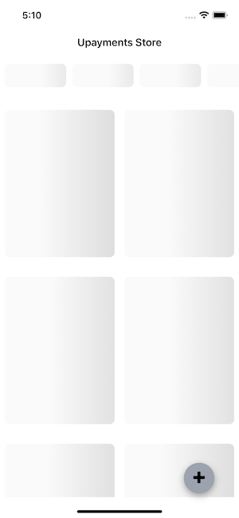

# Overview





## Philosophy

- Production-ready
- Minimal code and dependencies
- Best third-party libraries

## Features

- Latest Expo SDK
- [EAS Build](https://docs.expo.dev/build/introduction/) for easy distribution & deployment
- All Typescript and functional components.
- Tailwind UI
- Multiple environment builds [Production, Staging, Development] using Expo configuration
- Clean project structure with Absolute imports
- [React Native Gesture Handler](https://docs.swmansion.com/react-native-gesture-handler/) for native gesture handling.
- [React Navigation](https://reactnavigation.org/) with Native stack instead of JS one
- Data fetching & caching layer with [React Query](https://react-query.tanstack.com) & [Axios](https://github.com/axios/axios)
- Excellent form handling with minimum re-renders using [react-hook-form](https://react-hook-form.com) and validation with [zod](https://github.com/colinhacks/zod)
- Fast & Performant Lists with [Flash List](https://shopify.github.io/flash-list/)
- Skeleton loading for better UX
- Easy state management with [zustand](https://github.com/pmndrs/zustand)
- Tests with [Jest](https://jestjs.io/)<br/><br/>

# Installation

```console
yarn install
```

## Local Development

```console
npx expo start
```

## Running Tests

```console
yarn test
```

## Building with env

- Check package.json for all scripts.

Example

```console
yarn build:development:ios, build:staging:ios, build:production:ios
```

# Configuration

The project is already configured for 3 different environments [development, staging, production]

```js
# config/config.js
const packageJSON = require("../package.json");

const APP_ENV = process.env.APP_ENV ?? "development";
const SCHEME = "com.upayments";
const APP_NAME = "UPayments";
const API_BASE_URL = "https://upayments-studycase-api.herokuapp.com/api/";
const DEVELOPER_EMAIL = "orkanylmz@gmail.com";
const API_TOKEN = "...";

const development = {
  APP_ENV: "development",
  name: APP_NAME,
  scheme: `${SCHEME}.development`,
  icon: "./assets/icon.development.png",
  foregroundImage: "./assets/icon.development.png",
  version: packageJSON.version,
  API_BASE_URL,
  API_TOKEN,
  DEVELOPER_EMAIL,
};

const staging = {
  APP_ENV: "staging",
  name: APP_NAME,
  scheme: `${SCHEME}.staging`,
  icon: "./assets/icon.staging.png",
  foregroundImage: "./assets/icon.staging.png",
  version: packageJSON.version,
  API_BASE_URL,
  API_TOKEN,
  DEVELOPER_EMAIL,
};

const production = {
  APP_ENV: "production",
  name: APP_NAME,
  scheme: `${SCHEME}.production`,
  icon: "./assets/icon.png",
  foregroundImage: "./assets/icon.png",
  version: packageJSON.version,
  API_BASE_URL,
  API_TOKEN,
  DEVELOPER_EMAIL,
};

const configs = { development, staging, production };

const Config = configs[APP_ENV];
module.exports = { Config };
```

# Project Structure

An architecture called [Screaming Architecture](https://blog.cleancoder.com/uncle-bob/2011/09/30/Screaming-Architecture.html) (by Uncle Bob) was used in the project.

It suggest to combine things that belongs to same feature. So anybody can take a look at the source repository and get the idea about what this system does very quickly.

### File Namings

It uses kabab-case for naming files and folders as we think it's the most readable and consistent way to name files and folders in large projects and it's the most common way to name files and folders in the react native community.

```bash title="Project Structure"
src
├── api
│   ├── categories
│   │   ├── index.ts
│   │   ├── types.ts
│   │   └── use-categories.ts
│   ├── common
│   │   ├── api-provider.component.tsx
│   │   ├── client.ts
│   │   ├── index.tsx
│   │   └── utils.ts
│   ├── index.tsx
│   └── products
│       ├── index.ts
│       ├── types.ts
│       ├── use-create-product.ts
│       ├── use-product.ts
│       └── use-products.ts
├── components # just common components
│   ├── bottom-sheet-handle.component.tsx
│   ├── create-product-button.component.tsx
│   └── index.ts
├── features # all features of the app
│   ├── app
│   │   ├── app-loading.component.tsx
│   │   ├── app.component.tsx
│   │   └── index.ts
│   ├── categories
│   │   ├── categories-list
│   │   │   ├── categories-item.component.tsx
│   │   │   ├── categories-list.component.tsx
│   │   │   ├── categories-skeleton.component.tsx
│   │   │   └── index.ts
│   │   ├── categories.context.ts
│   │   └── index.ts
│   ├── navigation
│   │   ├── index.ts
│   │   ├── navigation-container.component.tsx
│   │   ├── root.navigator.tsx
│   │   └── types.ts
│   ├── product
│   │   ├── create-product-form
│   │   │   ├── create-product-form.component.tsx
│   │   │   ├── create-product-form.test.tsx
│   │   │   └── index.ts
│   │   ├── index.ts
│   │   ├── product-details
│   │   │   ├── index.ts
│   │   │   ├── product-details-image.component.tsx
│   │   │   ├── product-details-skeleton.component.tsx
│   │   │   └── product-details.component.tsx
│   │   ├── product-filter-list
│   │   └── product-list
│   │       ├── index.ts
│   │       ├── product-item.component.tsx
│   │       ├── product-list-skeleton.component.tsx
│   │       └── product-list.component.tsx
│   └── ui
│       ├── core
│       │   ├── form
│       │   │   ├── form-input.component.tsx
│       │   │   └── index.ts
│       │   ├── index.tsx
│       │   └── input.component.tsx
│       └── index.ts
└── screens #screens that uses features
    ├── home
    │   └── index.tsx
    ├── index.ts
    └── product
        ├── create-product.screen.tsx
        ├── index.ts
        └── product-details.screen.tsx
```
